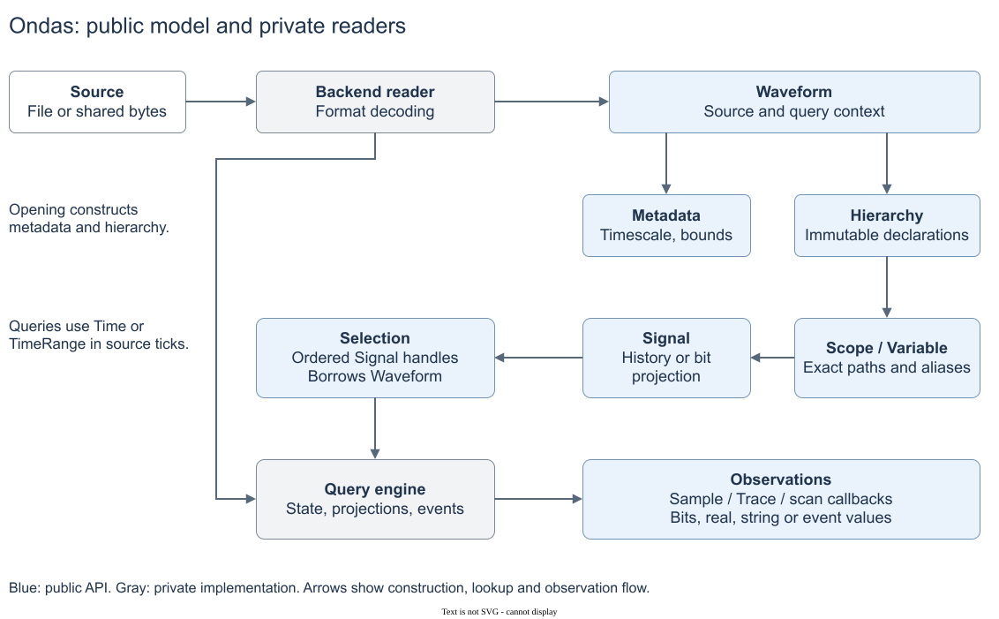

# ondas

A read-only Rust library for waveform analysis. The goal is to support more
waveform formats than any other library, including proprietary formats, through
one API with consistent query semantics.



[API documentation](https://docs.rs/ondas) · [Library model](docs/model.md)

## Usage

```toml
[dependencies]
ondas = "1"
```

See the [API examples](https://docs.rs/ondas/latest/ondas/#read-a-signal) for
opening waveforms, resolving signals and querying values. VCD and FST readers
are included by default; FSDB requires the optional feature and a local SDK.

## Backends

| Backend | Format | Implementation | Documentation |
|---|---|---|---|
| `vcd-native` | VCD | Built-in Rust parser; no external parser dependency | [docs/vcd-native.md](docs/vcd-native.md) |
| `fst-lib` | FST | `fst-reader` 0.17.0 | [docs/fst-lib.md](docs/fst-lib.md) |
| `fsdb-lib` | FSDB | Optional `fsdb-lib` feature; local Verdi FSDB Reader SDK, file-only | [docs/fsdb-lib.md](docs/fsdb-lib.md) |

## Development

Requires Linux, Git, Docker and the [Dev Container CLI](https://github.com/devcontainers/cli).
Rust 1.88 or newer is required; the container supplies the toolchain.

```sh
./dev --install-hooks
./dev just check-local
# Configure ONDAS_FIXTURES in .env before installation/full CI.
./dev just fixtures-install
./dev just ci
./dev just msrv
```

`check-local` needs no external fixtures. `ci` includes conformance;
`./dev just conformance` runs that suite on its own.

[Development setup](docs/automation.md) · [Testing](docs/testing.md)

Licensed under Apache License 2.0.
