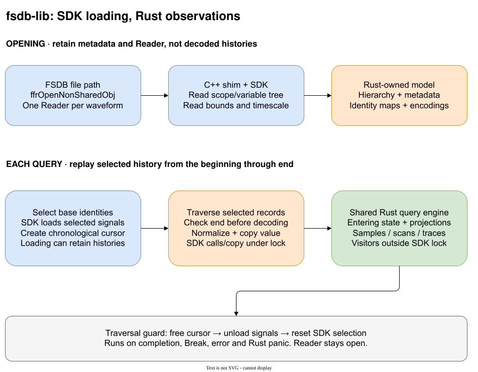

# FSDB Lib backend

`fsdb-lib` is Ondas's optional FSDB backend. It reads binary FSDB through the
Synopsys FSDB Reader SDK from Verdi (2021+). A private C++ shim
calls the SDK; the Rust adapter maps declarations, SDK identities and value records into
the common model. It accepts files, not bytes or streams, and does not convert
FSDB to another format.

The implementation is private. [Rustdoc](https://docs.rs/ondas) describes reader
selection and public observation contracts; this document covers the backend's
data flow, storage and limits.

## Dependencies and deployment

The additive Cargo feature is also named `fsdb-lib`. The supported source-build
target is `x86_64-unknown-linux-gnu`. `VERDI_HOME` selects the installed Verdi root
in the filesystem where Cargo runs. The build requires a C++11 compiler, binutils
`readelf`, zlib development files and the corresponding C++ runtime. It uses
`share/FsdbReader` headers and the SDK's `linux64` library directory (`LINUX64` is
also recognized). Missing inputs fail a feature-enabled build; feature-disabled
builds neither discover nor link the SDK. Older SDKs can reject files written in
newer FSDB format versions; use a newer Reader for those files.

Only Ondas's own Rust adapter, C++ shim, private C ABI header and dependency-link
anchors are distributed. SDK headers, libraries, manuals and fixtures are not
copied into the crate. Use and redistribution permissions remain the user's
responsibility; absence of a runtime license checkout is not a grant of rights.

The shim is a static archive; the installed Reader libraries are linked
dynamically. These libraries have no ELF `SONAME`, so a generated linker script
retains their absolute paths in the consumer's `DT_NEEDED` entries. A private
two-address object keeps `libnsys` and zlib from being discarded by lld's
`--as-needed`: the Reader library does not declare those dependencies itself.
No vendor symbol contents are read through these anchors. SDK variants with
`SONAME` are rejected rather than relying on an unspecified loader search path.

The SDK must remain available at its build-time path for the executable's
lifetime. Moving it requires rebuilding; removing it can prevent process startup
before Rust runs, even when the application only intends to read VCD/FST. This is
not a relocatable binary distribution or a graceful runtime-absence mechanism.
An RPATH on this crate's own targets would not cover downstream library consumers.

Local container mounts and vendor test gates belong in [automation](automation.md).
Mount the full SDK and fixture providers read-only through an ignored local
profile; keep vendor outputs separate and vendor files out of images and Docker
build contexts.

## How it works

The diagram shows the cold-query path; compatible repeated selections can use
the normalized checkpoint described below.

### Opening

Content recognition precedes filename extensions. The ordinary FST signature
includes its header-section length because a single initial zero byte also
occurs in FSDB. The enabled Reader probes otherwise unrecognized file contents;
case-insensitive extensions provide the fallback. Explicit selection never
switches backends after an opening failure.

The shim opens one `ffrOpenNonSharedObj` per waveform and calls
`ffrReadScopeVarTree`. When present, datatype blocks are read first so enumeration
definitions are available to declaration callbacks. Tree callbacks collect scope
and variable descriptors;
Rust builds the hierarchy and maps SDK identities to common base signals.
Aliases retain separate declarations but share a base identity. Header queries
supply bounds, timescale, writer and date.

The returned `Waveform` retains the owned hierarchy and metadata. Its adapter
keeps the Reader object, identity/index maps and encodings; the shim retains
hierarchy descriptors. Opening does not traverse
all value histories or certify that every later record can be decoded.

`read_metadata(path)` uses the same SDK file open and header queries but skips
datatype and hierarchy callbacks. It closes the SDK object after copying the
metadata. It does not validate declarations; `open(path)` still does.

Actual Unix path bytes are passed to the SDK, including non-UTF-8 names;
`source_name` is only a display string. Embedded NUL is rejected. There are no
hidden temporary files or memory-file adapters. Keep the source unchanged while
open.

### Queries

Cold bit-only point samples use per-signal SDK seeks after loading the deduplicated
base selection. Each seek finishes its aligned tick. The reader walks earlier
completed ticks until the selected projection differs, establishing its exact
normalized `changed_at`; an initial or constant projected state retains `None`.
This also handles same-tick excursions and redundant writes. A constant projection
can still require walking its full history. Mixed-value and event selections keep
the chronological reference path.

The resulting bounded point snapshot represents state after the requested tick.
It can serve the same point again or seed later windows, never the entering state
of a window beginning at that tick or earlier. Point snapshots use the existing
selection cache budget and are discarded on break, error or panic.

For a window `[start, end]`, the shared query layer resolves aliases and
projections into selected base signals. The shim adds their SDK identities with
`ffrAddToSignalList`, calls `ffrLoadSignals`, and creates a chronological cursor
with `ffrCreateTimeBasedVCTrvsHdl`.

Cold traversal starts at the beginning, not at `start`. Earlier selected records
establish entering values for late windows. A persistent-only selection can retain
one normalized boundary checkpoint, using the query engine's existing 4 MiB
checkpoint budget. Compatible later requests restore exact values and projected
change times and position the SDK view at the saved boundary. Earlier windows,
event selections and oversized checkpoints use the full-prefix path. Break,
error and panic discard the checkpoint.

A successful persistent-only query also retains its final bounded slot state
and next unread tick. Repeated point reads need no SDK traversal; forward reads
can resume from that state. Earlier windows use the boundary checkpoint or
full replay; cold bit-only points can seek independently. Neither snapshot accumulates requested times or retains SDK
histories. Both snapshots are discarded on break, error or panic; a new selection
starts without them and never shares another selection's state. Event selections
use the reference path for exact preceding-tick counts, and `u64::MAX` has no
resumable next tick.

The cursor checks each timestamp
against the inclusive `end` **before decoding the value**, so an excluded record
does not fail a prefix query. Equal-tick cross-signal order is not a public
guarantee. The raw SDK traversal does not sort or collapse records; the shared
query engine applies the public tick normalization described below.

The shim reads storage metadata before `ffrGetVC`, validates each logic code and
writes normalized digits directly into the caller-owned Rust byte buffer. Rust
checks the declared width and borrows those already validated digits without
another release-build validation pass. Reals and strings are copied from
transient SDK storage while holding the lock. After unlocking, Rust decodes
reals and strings and passes borrowed values to the shared
query engine. That engine applies projections, tracks entering state, and emits
final persistent tick changes and per-tick event aggregates. Samples consume all observations
at their requested tick; scans can stop with `Break`; owned traces collect output.

When the file supports view windows, loading uses the checkpoint boundary (or
zero without a checkpoint) through the inclusive query end. The retained state
preserves exact normalized change times; SDK values preceding the boundary are
not emitted again. The
SDK loads complete flush sessions intersecting that window, not precisely the
requested ticks. Other files retain full loading.

A traversal guard frees the cursor, unloads selected values and resets the SDK
selection on completion, `Break`, error or Rust panic. A supported view window
is replaced before each load. The Reader remains open.
The next query creates a new traversal; it does not resume the previous cursor.

The adapter is in [`src/backends/fsdb.rs`](../src/backends/fsdb.rs), the SDK shim
in [`native/fsdb.cpp`](../native/fsdb.cpp), and linking in
[`build.rs`](../build.rs). Shared observation logic is in
[`src/query/engine.rs`](../src/query/engine.rs).

## Speed and memory

| Choice | Consequence |
|---|---|
| Hierarchy at opening | Opening retains declarations and identity maps, not decoded histories. Value errors can first appear during queries. |
| Load selected SDK signals through the query end | Loading precedes callbacks and is flush-session granular. The SDK may allocate substantial selected-history storage even for a short window or an early `Break`. |
| Bounded normalized checkpoint | A cold late window walks earlier selected records. Compatible repeated windows on the same persistent-only selection can skip that prefix; there is no multi-time index. |
| Batch base identities | Aliases and projections share SDK selection/loading. Chronological scans share base replay; cold points seek each distinct projection. Output order and duplicates are preserved. |
| Cold bit-only point seeks | Skip unrelated prefix records while proving the selected projection's change time. Native point bytes are copied under the SDK lock; no handle or SDK buffer escapes. Constant projections may still walk the prefix. |
| Caller-owned chronological logic buffer | Each traversal sizes one buffer to the widest selected base bit signal, even when no bit record is reached. Logic is validated/normalized directly into it; a separate reusable buffer copies non-bit records without clearing or resizing the bit destination. SDK pointers never reach visitors. |
| Selected-state reuse, no SDK history cache | One final snapshot and one bounded boundary checkpoint belong to the selection. Repeated points can avoid traversal; an actual traversal still performs SDK selection/loading and creates a new cursor. Neither cache grows with query history. |
| Serialized SDK calls | Independent waveform readers do not execute SDK operations concurrently through this adapter. Rust visitors run outside the lock. |
| Streaming observations | Shared query state retains bounded entering/pending values and event counts per selection entry. Owned traces additionally retain their output. |

Ondas adds no time index, checkpoint database, mmap or parallel decoder. SDK
loading is distinct from an adapter history cache; memory is not bounded by the
query engine's state alone. Compare the same artifact, selection and workload
under the [benchmarking policy](benchmarking.md), not inferred throughput claims.

## Supported data

### Names and declarations

- Identical declarations in appended hierarchy trees are coalesced. Distinct
  aliases retain their paths and share compatible SDK storage identities.
- Compatible repeated scopes merge and may supply an absent definition name.
  Conflicting definitions or scope metadata fail.
- The SDK's hidden-scope flag is retained. Hidden scopes and their descendants
  stay accessible; consumers choose whether to suppress them during traversal.
- Explicit vector ranges, including `[0:0]`, become declaration metadata. A
  matching trailing range is removed from unescaped names or after whitespace
  terminating an escaped identifier. An attached suffix on an escaped name stays
  literal even when the SDK supplies matching bounds. `Variable::reader_name`
  retains the pre-extraction SDK spelling, including the escape marker and any
  printed range, for consumers that distinguish those source forms. Memory indices
  remain names, not query projections.
- Known scope and variable kinds map to canonical names; unknown kinds remain
  namespaced. Direction and constant flags are retained when supplied.
- Record/struct members retain their containing scopes and available packing.
  Enum datatype definitions supply type names and encoded value/label tables.
  Typed enum and packed-variable callbacks remain visible. Enum histories with
  supported per-bit Verilog/VHDL logic storage are queryable as bits; other custom
  storage remains unsupported rather than guessed from labels or observed values.
- Unsupported declarations remain visible but fail query validation before
  visiting values. Not every composite or user-defined SDK type has a decoder.

### Values

| Value class | Behavior |
|---|---|
| Bits | Validate width and preserve every decoded bit. Ordinary digital storage preserves `0/1/x/z`; recognized VHDL logic storage preserves all nine states. Unknown logic codes fail. |
| Reals | Decode copied host-order binary32/binary64 bytes without alignment assumptions; promote binary32 to `f64`. Storage, not the source type name, determines precision. |
| Strings | Read NUL-terminated bytes, not the SDK's fixed-size string index. Map bytes reversibly to U+0000 through U+00FF (Latin-1), without UTF-8 inference. Embedded NUL is not supported. |
| Events | Normal HDL trigger records become occurrences; no-change initialization records are ignored. Unknown event records fail. Transaction event variables are unsupported. |

### Time and metadata

- Time is absolute unsigned integer ticks. Floating timestamp formats are
  rejected, not rounded; backwards traversal timestamps fail.
- Timescale factors are exact positive integers with supported units. An absent
  or empty scale remains absent; an unsupported nonempty scale fails opening.
- Recorded bounds come from the file, not the selected histories. Reversed bounds
  fail; a source without variable declarations has no recorded span in Ondas.
- Writer and date preserve present-empty strings. Comments are not populated.

## Controls and limits

### Events and recording gaps

Event queries on files with SDK-reported dump-off ranges are rejected. Recorded
HDL triggers do not establish physical event multiplicity during initialization
or disabled dumping. The adapter does not reconstruct unrecorded activity.
Transaction, assertion and object-database semantics are outside the common model.

### Ownership and threads

SDK types and pointers remain behind the private C ABI. Each waveform owns its
non-shared Reader; mutable query access owns its cursor exclusively. The Reader
guide recommends `ffrOpenNonSharedObj` for multithreaded applications.

All SDK operations, including open and destruction, are serialized within this
adapter. The Rust owner can move across threads. This lock does not coordinate
unrelated SDK users elsewhere in the process. Visitors run in Rust, outside the
lock and never from C++; a visitor can query a different waveform reentrantly.

### Malformed input and SDK failures

C++ exceptions are caught at the private boundary. Tree-callback failures are
saved and reported after the SDK returns. Indistinguishable SDK opening failures
become backend errors, not invented corruption diagnoses. Value failures can
occur after opening succeeds and scans may already have delivered observations.

SDK banners and warnings remain visible: Ondas does not suppress process-wide
stdout/stderr. Native crashes, aborts and malformed-input robustness are not
contained by exception handling. This is not a sandbox for untrusted files.

## Verification

The shared [conformance runner](../tests/conformance.rs), invoked through
`just conformance-fsdb`, uses the real SDK in file mode. Selected public inputs
are mandatory; available private inputs are checked too.
`ONDAS_REQUIRE_PRIVATE_FIXTURES=1` requires private inputs rather than permitting
absence skips. Invalid installed inputs fail. Locks and provider policy belong
in [fixtures](fixtures.md).

Focused tests cover duplicate selections, projections, boundaries, early stops,
reentrancy, panic cleanup, independent opens, thread movement and path handling.
Feature-disabled tests check availability and unchanged FST/VCD readers.
`just ci-fsdb` also runs a separate downstream executable on development Rust and
MSRV, launched directly without `LD_LIBRARY_PATH` or `VERDI_HOME` to verify native
dependency propagation.

See [testing](testing.md) for test strategy. Conformance checks supplied oracle
observations, not every value class, timestamp or format variant. Missing
coverage is a request to the fixture producer, never a reason to record this
adapter's output as its own oracle.
