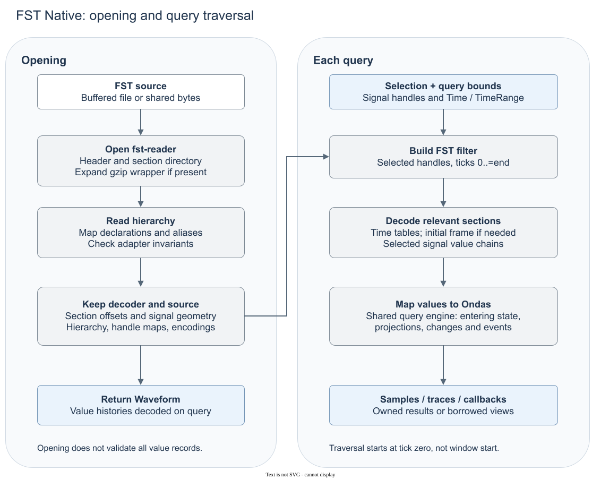

# FST Native backend

`fst-native` is Ondas's FST backend. It reads binary FST through
[fst-reader](https://github.com/ekiwi/fst-reader), which handles format decoding
and decompression. The Ondas adapter maps declarations, reader handles and value
callbacks into the common model. It accepts files and shared owned bytes.

The implementation is private. [Rustdoc](https://docs.rs/ondas) describes reader
selection and public observation contracts; this document covers the backend's
data flow, storage and limits.

## Dependencies

The backend uses `fst-reader` 0.17.0 (BSD-3-Clause).
The decoder uses Rust compression libraries and requires buffered, seekable input.

## How it works

### Opening

The decoder reads the header, signal geometry and section directory. Geometry
records signal types and lengths; the directory records where value sections
live and their time spans. It skips over value payloads rather than decoding all
histories. A whole-file gzip wrapper, when present, is first expanded into memory.

The adapter then asks the decoder to decompress and traverse the hierarchy. It
builds scopes and variables, maps aliases to shared signal storage and checks
scope consistency and alias encodings. Header fields supply recorded bounds and
timescale; hierarchy attributes supply additional declaration metadata.

The returned `Waveform` retains its hierarchy and metadata. Its reader keeps the
source, decoder section directory, signal geometry and handle/encoding mappings.
It does not retain decoded histories or request the decoder's optional global
time table. Successful opening does not certify all value records or hierarchy
completeness.

### Queries

For a window `[start, end]`, the adapter builds a decoder filter containing the
selected base handles and the time range **`0..=end`**, not `start..=end`. Reading
from zero establishes entering values reliably, including variable-length strings
that have no initial value in frame snapshots.

The decoder uses its directory to seek to sections overlapping that filter. For
each section, it reads the time table and signal offsets, decompresses selected
value chains and emits callbacks in time order. It may also read an initial frame.
A value chain holds one signal's encoded changes within a section; the decoder
loads that chain before delivering its individual changes.

The adapter converts callbacks to Ondas values. The shared query engine applies
projections, keeps state before `start` separate from in-window changes, removes
redundant persistent writes and counts events. Samples consume all observations
at their requested tick. Scans can stop traversal with `Break`; owned traces
collect their output. A subsequent query starts a new traversal, not a continuation
from the previous query's position.

The adapter is in [`src/backends/fst.rs`](../src/backends/fst.rs). Shared observation
logic is in [`src/query/engine.rs`](../src/query/engine.rs).

## Speed and memory

| Choice | Consequence |
|---|---|
| Section directory at opening | The decoder can seek past value sections without decoding them. Opening still reads metadata and decompresses the hierarchy; it is not full value validation. |
| Filtering from tick zero | A narrow late window still traverses earlier selected history. Section offsets do not make the adapter a direct lookup at the requested start tick. |
| Selected value chains | Unselected chains can be skipped, but selected chains are decompressed for the section, potentially beyond the query end. A callback break cannot undo that work. |
| Section-local decoding | Memory includes section time/offset tables, selected decompressed chains and per-handle arrays. An initial frame can require full-frame decompression even for a small selection. Memory is not bounded by the number of selected signals alone. |
| Batch selected signals | One traversal serves the batch. Aliases and projections share base reads; output order, duplicates and separate slice histories remain intact. |
| No cross-query history cache | Reusing a selection retains validated handles and grouping, not decoded values. Repeated queries repeat section reads and decompression. |
| Buffered files and shared bytes | Ordinary file input stays buffered; bytes input retains the shared source allocation. A whole-file gzip wrapper instead creates an in-memory decompressed source. |
| Streaming observations | The query engine keeps previous values per selection entry, not complete histories. Owned traces additionally retain their requested output. |

The adapter adds no time index, checkpoint database, mmap or parallel decoder.
The decoder's section directory and temporary tables are distinct from a retained
history cache. Sources must remain unchanged while open. Measure the same FST
artifact, workload and explicit reader under the
[benchmarking policy](benchmarking.md); these choices are not a throughput claim.

## Supported data

### Names and declarations

- Declarations remain separate from decoder history handles. Compatible aliases
  share signal storage; incompatible encodings fail.
- Compatible repeated scopes merge. Conflicting kind, definition name or packing
  metadata fails.
- A separated bit suffix such as `word [7:0]` becomes declaration range metadata.
  Attached brackets stay in the name. Declaration indices are distinct from the
  normalized positions used for projections.
- Known declaration kinds map to canonical names. Direction, constant flags,
  VHDL type names, enumeration tables and scope packing are retained when supplied.
- Source-path/stem attributes and standalone SV enum attributes are not exposed.

### Values

| Value class | Behavior |
|---|---|
| Bits | Preserve nine logic states and validate decoded width against the declaration. |
| Reals | Real declarations receive the decoder's floating-point values; they are not inferred from byte lengths. |
| Strings | Character bytes map reversibly to U+0000 through U+00FF (Latin-1), including NULs and padding. No UTF-8 inference. |
| Events | Preserve decoder callbacks as occurrences, subject to the first-tick limitation below. |
| Other zero-width declarations | Remain non-queryable rather than becoming real or string signals. |

### Time and metadata

- Time is absolute u64 ticks, not a position in a decoder time table.
- The header's decimal timescale exponent maps exactly to a supported factor/unit.
  An unrepresentable scale remains absent; no floating-point rounding is used.
- Recorded bounds come from the decoder header. Reversed bounds fail; a source
  without declarations has no recorded span in Ondas.
- Writer and date fields preserve present-empty strings; hierarchy comments retain
  their order.

## Controls and limits

### First-tick events and recording gaps

Frame snapshots and changes share a callback shape. Ondas preserves event
callbacks, including initialization at the first recorded tick. Exact event counts
there are a reader limitation: neither payload guessing nor dropping all first-tick
records resolves it.

Blackout metadata does not invent off-values or reconstruct unrecorded activity.
The query engine observes decoded records, not hidden physical transitions.

### Malformed input and decoder failures

Malformed files, including wrong header-section lengths, can panic in debug and
release builds. Some decoder paths also contain unsupported-case assertions.
Ondas does not intercept decoder panics. This is not a
hardened parser for untrusted files.

Reported decoder failures become Ondas errors. The adapter rejects scope-stack
underflow, unclosed scopes, conflicting repeated scope metadata, incompatible
alias encodings and invalid decoded values. Value failures can occur during a
query, after opening succeeds; scans may already have delivered observations.
These checks do not establish hierarchy completeness or universal format support.

## Verification

The shared [conformance runner](../tests/conformance.rs) discovers every FST in
the locked provider and checks listed metadata, declarations, samples and windows
in file/bytes modes. Samples and windows are batched; focused cases cover
selections, scans, candidates, projections and termination. Failures are aggregated,
not excluded, and provider additions need no manual case-list update.

See [testing](testing.md) for memory-reader versus adapter evidence. Sparse oracles
do not cover every signal, tick, compression variant or first-tick event behavior.

Converted artifacts retain [provenance](fixtures.md). Conversion alone does not
prove equivalence with the source: publish only observations established for the
result.
