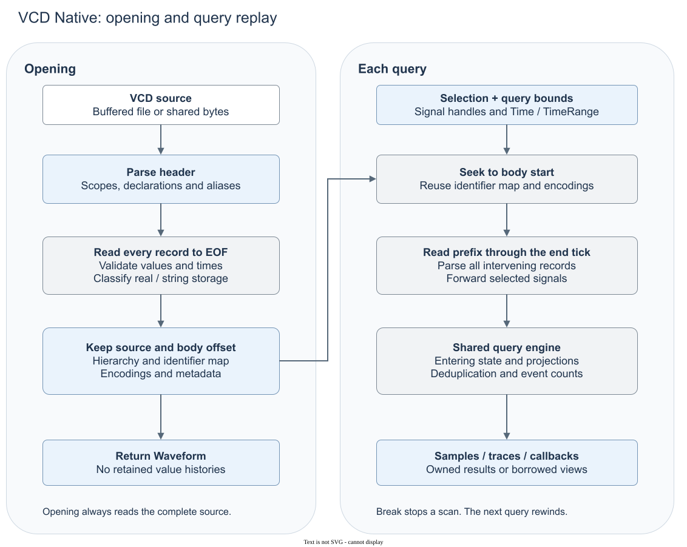

# VCD Native backend

`vcd-native` is Ondas's VCD backend. It uses its own Rust parser, with no external
parser library or conversion to another format. It accepts files and shared owned
bytes. IEEE 1364-2001 clause 18.2 is the baseline; the producer extensions below
are compatibility choices.

The implementation is private. [Rustdoc](https://docs.rs/ondas) describes reader
selection and public observation contracts; this document covers the backend's
data flow, storage and limits.

## How it works

### Opening

The header provides scopes, declarations and aliases. The reader builds a
hierarchy, maps identifier codes to shared signal storage and records the body
start offset. It then reads every body record to validate the source, determine
time bounds and settle encodings, including real declarations carrying strings.
Only then does it return a `Waveform`. The declarations and mappings survive;
the sequence of value records does not.

### Queries

A window `[start, end]` does not cause a seek to `start`: the reader seeks to the
body offset saved during opening. It parses every intervening record through
`end`, forwarding selected signals to the shared query engine. Records before
`start` establish entering state; records inside the window produce changes.
A sample likewise needs all records at its requested tick to obtain the final
state or event count.

The query engine applies projections, removes redundant persistent writes and
keeps entering state separate from changes. Scans emit callbacks without retaining
an entire trace; owned trace requests collect their output. `Break` stops a scan,
but it does not create a checkpoint for the next query. Queries do not reuse a
previous replay position.

The parser and replay loop are in [`src/backends/vcd.rs`](../src/backends/vcd.rs).
Shared observation logic is in [`src/query/engine.rs`](../src/query/engine.rs).

## Speed and memory

| Choice | Consequence |
|---|---|
| Full validation at opening | Opening reads the whole source before any query can run. Encodings and time bounds are then fixed. |
| Replay from the body start | Each query pays for the prefix through its end tick, including records before the requested range. A narrow late window is not a random-access read. |
| Batch selected signals | One traversal serves the batch. Reusable selections retain validated handles and grouping, not values from previous queries. |
| No history cache or time index | Repeated queries repeat parsing. The identifier lookup map resolves signals; it cannot seek to a tick. |
| Buffered file input | The reader does not load the entire file into memory. Bytes input, by contrast, retains the caller's shared source allocation. |
| Streaming observations | Working storage includes declarations, identifier maps, parser buffers and the previous value per selection entry, not the complete history. Wide values still need space. Owned traces also retain their requested output. |

The reader uses no checkpoint database, mmap or parallel parser. These choices
favor avoiding retained histories over fast repeated seeks; they are not a
throughput claim. Measure changes using the [benchmarking policy](benchmarking.md).
Sources must remain unchanged while open.

## Supported data

### Names and declarations

- Identifier codes are printable, contextual tokens, not numbers or commands.
  Hierarchy components preserve UTF-8 spelling.
- Compatible aliases share storage. Identical repeated declarations merge;
  conflicting names with different identifiers remain ambiguous.
- Separated bit ranges preserve direction and must agree with width. Attached
  `[msb:lsb]` suffixes are ranges only when their width agrees. Literal array
  indices and escaped brackets stay in names.
- Known SV/VHDL kinds map to canonical hyphenated names. Optional producer attributes are
  recognized but do not populate rich type metadata or expose simulator types.

### Values

| Value class | Behavior |
|---|---|
| Bits | Preserve all nine states. Short vectors extend with zero or their leading nonbinary state. Over-width vectors keep the least-significant digits after validation of the entire payload. |
| Zero-width bits | Remain non-queryable, including known empty binary records. They do not become real signals. |
| Reals | Checked parsing preserves signed zero and named NaN/Inf. |
| Strings | Decode common C, octal and two-digit hex escapes into Latin-1, preserving literal high-bit bytes, NULs and padding. |
| Real-declared strings | A declaration carrying only strings gets string storage, including numeric-looking text. Mixed real/string histories fail. |

### Time, metadata and text

- Timestamps are exact integral decimal u64 ticks, including `.0` forms.
  Decimal timescales normalize to an exact supported factor/unit without
  floating-point rounding.
- Metadata preserves internal whitespace, present-empty fields and comment order.
- A complete final token needs no newline. A UTF-8 BOM is accepted.
- Migen's closed declaration list may enter `$dumpvars` without `$enddefinitions`.

## Controls and limits

### Persistent state and recording gaps

Persistent records inside `$dumpvars`, `$dumpall`, `$dumpoff` and `$dumpon` apply
at the current tick. Markers do not invent off-values or hidden circuit activity.
Entering state remains strictly before the query boundary.

`changed_at` describes recorded transitions. A resume checkpoint establishes an
observed value, not the time of an unrecorded physical transition.

### Event checkpoints

Ordinary event records retain repetitions, including at the first tick. Records
inside dump blocks are snapshots and do not count as occurrences. This policy
cannot recover physical multiplicity on mixed checkpoint/event ticks. The public
oracle excludes those ticks and non-bit blackout windows.

### Unsupported features

- Nonzero timezero.
- EVCD port/strength records. A `port` declaration can carry ordinary bit records.
- Rich type metadata from optional attributes.

### Rejected input

Opening fails on unknown significant commands or identifiers, incompatible
storage aliases, invalid values, incomplete scopes/dump blocks and inputs without
declarations. Fractional, backwards and overflowing timestamps also fail.
Malformed input never becomes a successful empty waveform.

## Verification

[`tests/vcd_native.rs`](../tests/vcd_native.rs) checks lexical boundaries, exact
arithmetic, classification, controls, replay and ownership without external data.
The shared [conformance runner](../tests/conformance.rs) discovers every VCD in
the locked provider and checks listed metadata, declarations, samples and windows
in file/bytes modes. Expectations come from the independent instrumented
libgtkwave oracle, not this backend.

Sparse agreement is not exhaustive certification. See [testing](testing.md) and
[fixtures](fixtures.md) for the runner and oracle contracts.
