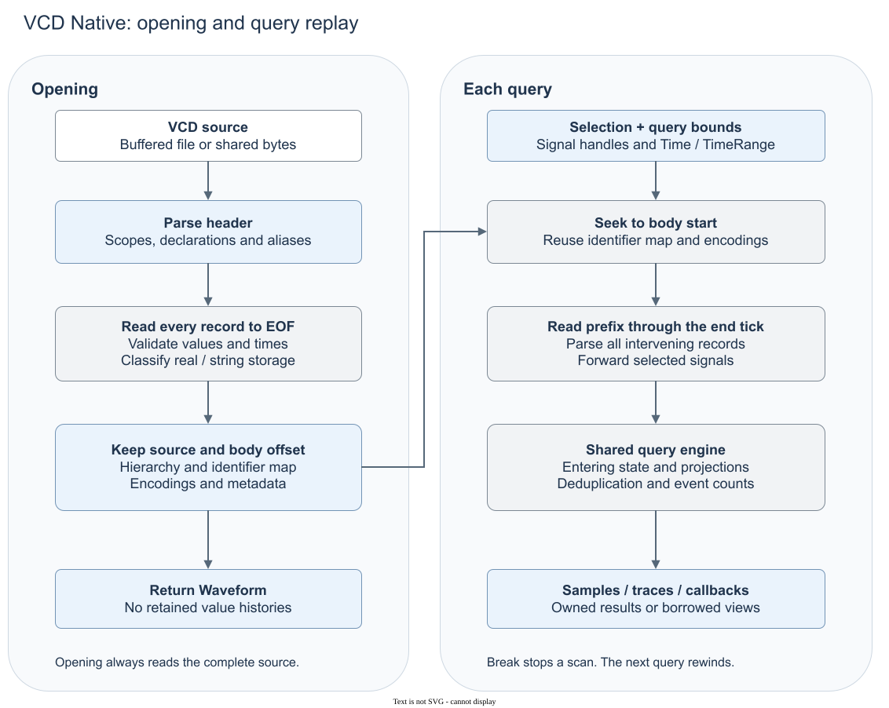

# VCD Native backend

`vcd-native` is Ondas's VCD backend. It uses its own Rust parser, with no external
parser library or conversion to another format. It accepts files and shared owned
bytes. IEEE 1364-2001 clause 18.2 is the baseline. The producer extensions below
are compatibility choices.

The implementation is private. [Rustdoc](https://docs.rs/ondas) describes reader
selection and public observation contracts. This document covers the backend's
data flow, storage and limits.

## How it works

### Opening

The header provides scopes, declarations and aliases. The reader builds a
hierarchy, maps identifier codes to shared signal storage and records the body
start offset. It then reads every body record to validate the source, determine
time bounds and settle encodings, including real declarations carrying strings.
Only then does it return a `Waveform`. On sufficiently large Unix file inputs,
the opening pass validates independent chunks bounded by timestamps. It uses
positional reads from the same file. Ambiguous boundaries or inconsistent chunks
fall back to the serial pass. Bytes inputs use the serial pass. The reader retains
declarations and mappings. It does not retain the sequence of value records.

### Queries

Without reusable selected state, records before a window `[start, end]`
establish entering state. Records inside the window produce changes. A sample
likewise needs every record at its requested tick for final state or event count.
On large Unix files that passed split validation at opening, eligible cold
bit/real selections can summarize only their selected prefix concurrently
and resume sequential replay at the next timestamp. Events, slices, strings,
oversized selections and ambiguous boundaries use serial prefix replay. For a
full-range file query, the same validated chunk boundaries can instead parse
selected records concurrently, delivering bounded batches in source order to
the existing query engine. Strings, small files, byte inputs, other platforms
and failed worker startup use serial full-range replay. Opening does not retain
histories or precompute query state.

The query engine applies projections and final-tick normalization, including
per-tick event aggregates, and keeps entering state separate from changes. Scans
emit callbacks without an unbounded history cache; eligible full-range file
scans may temporarily buffer selected records in bounded parallel batches.
Owned trace requests also collect their output. `Break` stops further callbacks,
discards queued batches, interrupts remaining worker reads and invalidates the
selection's replay state.

A reusable selection retains one private parser position and the entering/final
selected state at its last completed tick. Repeated and forward reads can resume
there. Earlier requests use a boundary checkpoint when eligible. Otherwise, they
replay from the body. Session reuse also requires the retained tick to precede
the session start. This preserves exact previous-tick event counts. Failed or
stopped traversals discard retained state. A new selection
always starts without retained values. No history or candidate list is cached.

A selection also retains at most one query-boundary checkpoint: normalized
selected state strictly before the requested range, together with the position
before its next selected record. Sessions place this boundary at `start - 1`
to preserve preceding-tick events. Repeating a late window can then avoid its
prefix. An eligible first use summarizes that prefix in bounded parallel chunks.
A changed boundary replaces the checkpoint. Requests before it may replay
sequentially.
The checkpoint includes dump-block context, not merely a timestamp/offset.

Checkpoint storage is capped at 4 MiB, counting the snapshot, slot array and
owned value bytes (excluding allocator overhead). An oversized snapshot is not
retained. This cap is additional to the working selection and last replay window;
opening builds no time or value index. The diagram above shows
the serial uncached path.

The parser and replay loop are in [`src/backends/vcd.rs`](../src/backends/vcd.rs).
Shared observation logic is in [`src/query/engine.rs`](../src/query/engine.rs).

## Speed and memory

| Choice | Consequence |
|---|---|
| Full validation at opening | Opening reads the whole source before any query can run. Large Unix files can split this work across cores without retaining value histories. Encodings, comments and time bounds are merged in source order. |
| On-demand selected prefix summaries | Large Unix files can process independent prefix chunks concurrently for eligible cold point or window queries. The target window is still replayed in order. Ineligible queries replay from the body. |
| Bounded full-range batch replay | Large Unix files can parse selected records in parallel from the original file handle and send batches in source order. Up to approximately 192 MiB of selected records may be in flight across workers (excluding allocator overhead), even for a streaming scan. Strings and oversized declared widths fall back to serial replay. The parser still reads the full text, and the opening pass is unchanged. |
| Batch selected signals | One traversal serves the batch. A reusable selection also retains bounded projected values and event counts for replay reuse. |
| No history cache or time index | A selection retains the last replay window and at most one bounded range-boundary snapshot. The identifier map alone cannot seek to a tick. |
| Buffered file input and reusable body token buffers | Whitespace and its following token are read together. Dense printable identifier codes use a bounded direct table. Sparse codes use the identifier map. The reader does not load the entire file into memory. Bytes input retains the caller's shared source allocation. |
| Streaming observations | Working storage includes declarations, identifier maps, parser buffers, bounded transient full-range batches, and entering/pending values and event counts per selection entry. Wide values still need space. Owned traces also retain their requested output. |

Source bit digits are validated before selection filtering, including high digits
that will be truncated. Padding or truncation then constructs the selected vector
from validated states without rescanning its full declared width. Selected
persistent values still need materialization for later accepted reads. Reducing
token allocation does not imply skipping source bytes or physical I/O.

Prepared repeated samples and windows can measure retained-state reuse rather
than parsing. Fresh-selection benchmark cases include the first prefix and
snapshot construction. Opening remains a separate operation.

The reader uses no persistent checkpoint database, mmap or complete value
history. Its large-file parallel passes hold bounded transient selected state,
not a reusable global time index. Measure changes using the [benchmarking policy](benchmarking.md).
Sources must remain unchanged while open.

## Supported data

### Names and declarations

- Identifier codes are printable, contextual tokens, not numbers or commands.
  Hierarchy components preserve UTF-8 spelling.
- Compatible aliases share storage. Identical repeated declarations merge.
  Conflicting names with different identifiers remain ambiguous.
- Separated bit ranges preserve direction and must agree with width. Attached
  `[msb:lsb]` suffixes are ranges only when their width agrees. Literal array
  indices and escaped brackets stay in names.
- Known SV/VHDL kinds map to canonical hyphenated names. The reader recognizes
  optional producer attributes. It does not use them to populate rich type metadata
  or expose simulator types.

### Values

| Value class | Behavior |
|---|---|
| Bits | Preserve all nine states. Short vectors extend with zero or their leading nonbinary state. Over-width vectors keep the least-significant digits after validation of the entire payload. |
| Zero-width bits | Remain non-queryable, including known empty binary records. They do not become real signals. |
| Reals | Checked parsing preserves signed zero and named NaN/Inf. |
| Strings | Decode common C, octal and two-digit hex escapes into Latin-1, preserving literal high-bit bytes, NULs and padding. |
| Real-declared strings | A declaration carrying only strings gets string storage, including numeric-looking text. Mixed real/string histories fail. |

### Time, metadata and text

- Timestamps are exact integer decimal u64 ticks, including `.0` forms.
  Decimal timescales normalize to an exact supported factor/unit without
  floating-point rounding.
- Metadata preserves internal whitespace, present-empty fields and comment order.
- A complete final token needs no newline. A UTF-8 BOM is accepted.
- Migen's closed declaration list may enter `$dumpvars` without `$enddefinitions`.

## Controls and limits

### Persistent state and recording gaps

Persistent records inside `$dumpvars`, `$dumpall`, `$dumpoff` and `$dumpon` apply
at the current tick. Markers do not invent off-values or hidden circuit activity.
Entering state remains strictly before the query boundary.

`changed_at` describes recorded transitions. A resume checkpoint establishes an
observed value, not the time of an unrecorded physical transition.

### Event checkpoints

Ordinary event records retain repetitions, including at the first tick. Records
inside dump blocks are snapshots and do not count as occurrences. This policy
cannot recover physical multiplicity on mixed checkpoint/event ticks. The public
oracle excludes those ticks and non-bit blackout windows.

### Unsupported features

- Nonzero timezero.
- EVCD port/strength records. A `port` declaration can carry ordinary bit records.
- Rich type metadata from optional attributes.

### Rejected input

Opening fails on unknown significant commands or identifiers, incompatible
storage aliases, invalid values, incomplete scopes/dump blocks and inputs without
declarations. Fractional, backwards and overflowing timestamps also fail.
The reader does not turn malformed input into a successful empty waveform.

## Verification

[`tests/vcd_native.rs`](../tests/vcd_native.rs) checks lexical boundaries, exact
arithmetic, classification, controls, replay and ownership without external data.
The shared [conformance runner](../tests/conformance.rs) discovers every VCD in
the pinned fixture submodule and checks listed metadata, declarations, samples and windows
in file/bytes modes. Expectations come from the independent instrumented
libgtkwave oracle, not this backend.

Agreement with sparse observations does not prove all behavior. See [testing](testing.md) and
[fixtures](fixtures.md) for the runner and oracle contracts.
